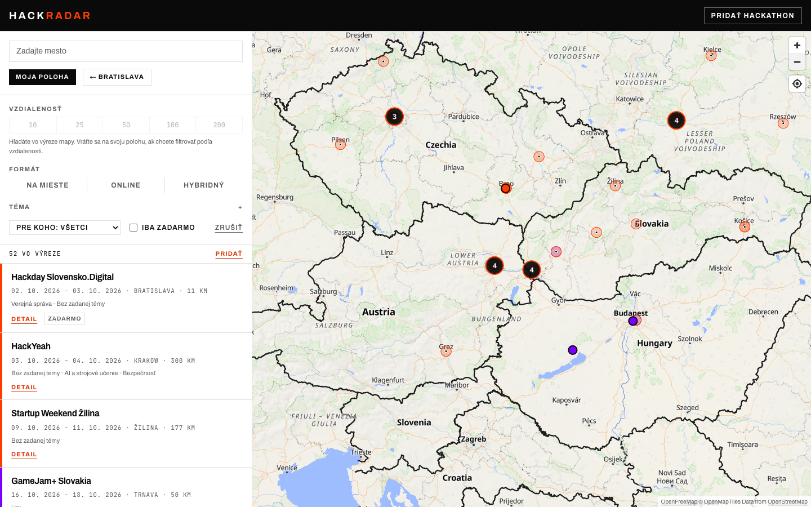
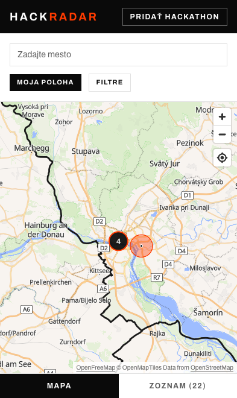
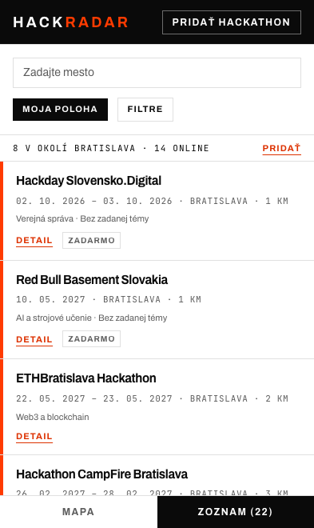
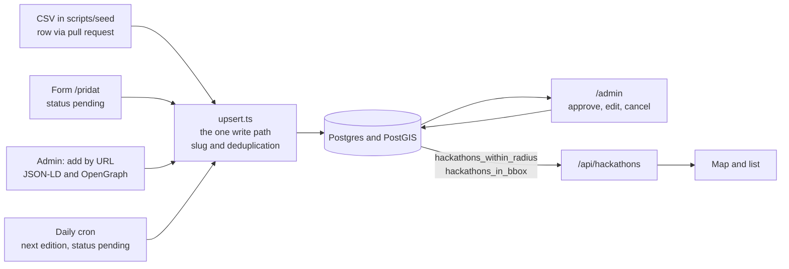

# HackRadar

[Slovenská verzia](README.md)

A map of hackathons in Central Europe. Say where you are and see what is within 10 to 200 km, on a map and in a list, with dates, topics, price and a registration link.

<p align="center">
  
</p>

<p align="center">
  
  
  
</p>

The screenshots come from a local production build with the data in this repository (30 Sep 2026), at 1440 x 900 and 393 x 660. The interface is in Slovak. There is no live demo yet, the project runs locally.

## What it does

- **Search by place.** The My location button or a city search, with a radius of 10, 25, 50, 100 or 200 km. Moving the map switches the search to the visible area.
- **Filters.** Format (on site, online, hybrid), 16 topics, audience, free only. The API also takes a time window.
- **Event page.** Dates in the event's own time zone, a countdown to the registration deadline, a map, a calendar export (`.ics`) and structured data for search engines.
- **Cities.** 14 prerendered pages, for example `/hackathony/bratislava`.
- **Light and dark** follow the system setting.
- **Adding data.** A public form at `/pridat`, pull requests to a CSV, moderation at `/admin`, add by URL and recurring events. Details below.

## Run it without any keys

You need Node 24, Docker and the Supabase CLI. Everything runs locally, nothing is paid and no key is needed.

```bash
git clone https://github.com/matuskalis/hackradar.git
cd hackradar
npm ci
supabase start
```

The first `supabase start` pulls Docker images and starts Postgres with PostGIS, the API, auth and a mail inbox. Migrations apply by themselves. For fewer containers add `-x studio,imgproxy,realtime,storage,edge-runtime,vector`.

The values from local Supabase go into `.env.local`, which is not in the repository:

```bash
supabase status -o env \
  | sed -n 's/^API_URL=/NEXT_PUBLIC_SUPABASE_URL=/p; s/^ANON_KEY=/NEXT_PUBLIC_SUPABASE_ANON_KEY=/p; s/^SERVICE_ROLE_KEY=/SUPABASE_SERVICE_ROLE_KEY=/p' \
  > .env.local
cat >> .env.local <<'EOF'
NEXT_PUBLIC_SITE_URL=http://localhost:3000
ADMIN_EMAILS=you@example.com
CRON_SECRET=local-secret
EOF
```

```bash
npm run seed   # 119 CSV rows, no network, a few seconds
npm run dev    # http://localhost:3000
```

The seed reads 7 files and, after merging duplicates, leaves 107 events. Coordinates are already stored in `scripts/seed/geocodes.json`, so no service is called. The map needs the internet for OpenFreeMap tiles, and the city search calls the Photon geocoder.

The admin is at `http://localhost:3000/admin`. Sign in with the address in `ADMIN_EMAILS`; the magic link arrives in the local Mailpit inbox at `http://127.0.0.1:54524`.

### Environment variables

| Variable | What it is for |
|---|---|
| `NEXT_PUBLIC_SUPABASE_URL` | Supabase API address |
| `NEXT_PUBLIC_SUPABASE_ANON_KEY` | public key, reads published rows only |
| `SUPABASE_SERVICE_ROLE_KEY` | writes from the server and scripts, **must never reach the browser** |
| `NEXT_PUBLIC_SITE_URL` | absolute site URL, read by the sitemap, canonical URLs and ICS |
| `ADMIN_EMAILS` | comma-separated addresses allowed into `/admin` |
| `CRON_SECRET` | secret for `/api/cron/recurring`, the route answers 401 without it |
| `NEXT_PUBLIC_MAP_STYLE_URL` | light map style, OpenFreeMap Liberty by default |
| `NEXT_PUBLIC_MAP_STYLE_DARK_URL` | dark map style, OpenFreeMap Dark by default |

Local Supabase uses ports 54521 (API), 54522 (database), 54523 (Studio) and 54524 (Mailpit), so it does not collide with other projects.

## How data gets in and stays fresh



| Path | Who uses it | What happens |
|---|---|---|
| CSV in `scripts/seed/` | curator, contributor by pull request (rules in `CONTRIBUTING.md`) | published after `npm run seed` |
| Form `/pridat` | organiser | status `pending`, waits for approval |
| Admin, add by URL | curator | the page is fetched and read (JSON-LD, OpenGraph, `<time>`), the admin confirms the fields |
| Daily cron `/api/cron/recurring` | automatic, 03:20 UTC | the next edition of a yearly event, status `pending` |
| E-mail | anyone who knows of an event | the curator adds it by one of the paths above |

The project had automatic importers and dropped them on 8 Sep 2026. MLH, Hack Club and the other sources checked have no Central European hackathons, and over their whole run they added one event out of 106. The sources checked and the reasons are in `docs/sources.md` and `docs/landscape.md` (in Slovak).

Moderation at `/admin` has tabs for Pending, Published and Needs attention. A location is fixed by dragging a pin on a map. A moderator's decision is permanent: the write path never overwrites the `status` of an existing row, and a row with `edited_at` set only gets its empty columns filled by an import. A rejected row stays rejected after the next `npm run seed`.

**Recurring events.** When a yearly event ends, the cron creates the next edition: same venue, link and topics, dates shifted by 52 weeks (so the weekday stays the same, hackathons tend to be weekends) and the year at the end of the name rewritten. The new row is `pending` and its `parent_id` points at the previous edition. A unique index on `parent_id` makes the run idempotent. If the next edition is already in the database the rows are only linked.

**Freshness in numbers (30 Sep 2026).** Of 107 events, 76 are upcoming and 39 of those end within 90 days. 42 events are marked as yearly. Without new rows the map would slowly empty, so adding data is part of the design, not an afterthought.

## Location and matching

**Geocoding.** An address becomes coordinates through [Photon](https://photon.komoot.io/), biased to a Central Europe box. The seed and the form send at most one request per 1.1 s. Every result, and every miss, is cached in the `geocode_cache` table. A result has precision `venue` (a street was given) or `city` (only a city). A `city` point is just the geocoder's match for the city name, so the map draws it as an area rather than a pin, and the event page says "approximate location". Of the 62 upcoming events with a place, 21 are exact and 41 are city level.

**Search.** It is SQL, not JavaScript. `hackathons_within_radius` and `hackathons_in_bbox` (in `supabase/migrations/`) work on the `geography` type, so distances are metres on the WGS84 spheroid, with a GiST index on `location`.

- Results are published events that have not ended (`end_at >= now()`).
- The radius uses `st_dwithin`. Online events have no place, so they go last without a distance and can be switched off.
- The bounding box returns located events inside the rectangle, with distance measured from its centre.
- Filters: format, topic overlap, audience, free (an unknown price counts as free) and a time window. The limit is 200 rows for the radius and 500 for the box.
- `/api/hackathons` validates input with a schema (the radius must be one of the offered values, the box must have correct corners), allows 120 requests a minute and is cached 60 s at the edge.

**Duplicate matching.** Two records are the same event if they start within 24 hours of each other and share a normalised name or a registration link (or event page link). Names are compared without diacritics, case, years, edition numbers and spaces, so `Hack Košice 2027` and `HackKošice #8` match. Links are compared as host plus path, not the host alone, because one platform hosts many unrelated events. Different cities never merge, since one hackathon often runs in several cities in parallel behind one signup page. A record from another source only fills empty columns and is listed under `extra_sources`.

**Time zones.** Dates render in the event's zone, not the server's or the reader's. The server on Vercel runs in UTC, and an event just after midnight in Warsaw would otherwise show the previous day. The zone is validated on input, because an unknown name throws a `RangeError` when a page renders.

## Decisions and what they cost

1. **People collect the events, not scripts.** The importers delivered 1 event out of 106, so they were removed. Cost: freshness depends on the curator's time. The daily cron, the pull request path and the number above soften it: two thirds of the events end within half a year.
2. **The geo logic lives in SQL.** The client gets finished, ordered results and the status and date rules cannot be bypassed. Cost: the logic cannot be tried without a database, so 19 tests run against a real PostGIS. `hackathons_within_radius` adds online events with an `OR`, which keeps the planner from using the index. On 100,000 synthetic rows the bare predicate takes 9.8 ms with the index, while the whole function scans the table (Parallel Seq Scan, 103 ms). At 107 rows this does not matter, it is a known ceiling (method in `docs/verification.md`).
3. **One write path.** The seed, the form, the admin and the cron all go through `lib/hackathons/upsert.ts` or `moderation.ts`, so slug generation, deduplication and protection of moderator decisions live in one place. Cost: a write does several queries per row and there is no batch path. Seeding 119 rows takes a few seconds.

## Verified

| What | Result | How |
|---|---|---|
| Unit tests | 13 files, 132 tests | `npm test` |
| Tests against PostGIS and RLS | 19 tests | `npm run test:db` with local Supabase, skipped in CI |
| CI on a clean Linux | install, typecheck, lint, tests, build pass | simulated in `node:24-slim`, steps in `docs/verification.md` |
| Build | 29 pages | `npm run build`, about 14 s warm and 42 s cold |
| Text contrast | 4.65:1 light, 5.54:1 dark (was 3.57:1) | measured in Chromium, `docs/verification.md` |
| Horizontal overflow | none at 1440 x 900 and 393 x 660 | home, event, form, city, login |
| JavaScript on first load | 184 KB gzip form, about 450 KB map pages (MapLibre is 269 KB) | scripts referenced from the HTML |
| API latency (local, median of 30) | 59 ms radius, 61 ms box, 18 ms event page, 4 ms city page | `curl`, local build and local Supabase |
| `npm audit` | 1 critical finding (MapLibre 5.x, mitigated), was 3 | `npm audit` |

The latencies come from a busy laptop, read them as orders of magnitude. The security headers, the form's origin check and the 401 without `CRON_SECRET` were checked on the running app.

## Tests

```bash
npm test            # unit tests, about 2 s, the database ones are skipped
npm run test:db     # against local Supabase, needs the same variables as the app
npm run typecheck
npm run lint
npm run build
```

`npm run typecheck` first generates the route types (`next typegen`); without them a clean clone does not typecheck. The database tests refuse a URL that is not local, and only write rows whose slug starts with `itest-`, which they delete at the end.

## Status and limits

- There is no live demo. The interface is Slovak only, although most events are in Poland (22 upcoming, Czechia 17, Slovakia 13, Austria 8, Hungary 4).
- Events are added by hand. No import and no dead-link check run.
- 44 of the 119 CSV rows have no confirmed date: 42 are estimated from the previous edition (the new one is not announced yet) and 2 are already past. They look confirmed on the map, because `date_confidence` is not stored.
- A city-level point is approximate. The Free only filter counts an unknown price as free.
- No accounts and no alerts. The calendar exports one event at a time.
- The rate limit keys on the first address in `X-Forwarded-For`, which can be spoofed (`SECURITY.md`).
- MapLibre is deliberately on version 5. It has a published advisory (GHSA-jrc7-96c5-q579) and the vulnerable path is switched off in the code. I tried 6.11.2 on 30 Sep 2026: `npm audit` is clean but the map does not start under Turbopack (`Worker failed to load`). Details in `SECURITY.md`.
- Map tiles and the geocoder are public services with no availability guarantee.

## Structure

```
app/                 pages and route handlers
components/          map/, explore/, search/, submit/, admin/
lib/                 db/, hackathons/, extract/, validation/, hooks/, ics, taxonomy, cities
scripts/seed/        the seed, CSV files and geocodes.json
supabase/migrations/ schema, RLS, functions
tests/               unit tests, tests/db against PostGIS
docs/                roadmap, sources, landscape, spec-curation, verification, seed-notes*
```

The visual system is in `app/globals.css`: colours, fonts and shapes are tokens in the `@theme` block and dark mode overrides them under `:root`. Format colours also live in `components/map/mapStyle.ts`, because MapLibre expressions cannot read CSS variables, so change both places together. The orange `--color-accent` is for graphics only; text and fills under white text use `--color-accent-text` and `--color-accent-fill` so they keep at least 4.5:1 contrast.

The plan for later is in `docs/roadmap.md`, the security audit in `SECURITY.md`. Most of `docs/` is in Slovak.

## Data sources and credits

- **Events.** Collected by hand from organisers' public pages. Every row has a `source_url`, and how rows were verified is in `docs/seed-notes*.md`.
- **Geocoding.** [Photon](https://photon.komoot.io/) by komoot, on data from [OpenStreetMap](https://www.openstreetmap.org/copyright) contributors.
- **Map.** Tiles from [OpenFreeMap](https://openfreemap.org/), (c) OpenMapTiles, data from OpenStreetMap, rendered with [MapLibre GL JS](https://maplibre.org/). Attribution is shown on the map.
- **Fonts.** Archivo and JetBrains Mono through `next/font`.

## Contact

Know of a hackathon in Central Europe? Write to m3kalis@gmail.com or use the form at `/pridat`.
