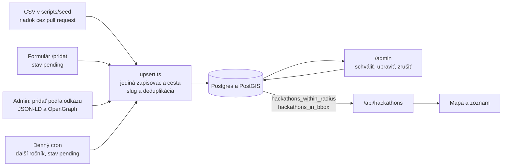

# HackRadar

[English version](README.en.md)

Mapa hackathonov v strednej Európe. Povedzte, kde ste, a uvidíte, čo je v okruhu 10 až 200 km: na mape aj v zozname, s termínom, témou, cenou a odkazom na registráciu.

<p align="center">
  
</p>

<p align="center">
  
  
  
</p>

Snímky sú z lokálneho produkčného buildu s dátami z tohto repozitára (30. 9. 2026), v okne 1440 × 900 a 393 × 660. Živé demo zatiaľ nie je, projekt sa spúšťa lokálne.

## Čo vie

- **Hľadanie podľa polohy.** Tlačidlo Moja poloha alebo vyhľadanie mesta, okruh 10, 25, 50, 100 alebo 200 km. Keď posuniete mapu, hľadá sa vo výreze.
- **Filtre.** Formát (na mieste, online, hybridný), 16 tém, pre koho, iba zadarmo. API pozná aj časové okno.
- **Detail.** Termín v časovom pásme podujatia, odpočet do konca registrácie, poloha na mape, export do kalendára (`.ics`) a štruktúrované dáta pre vyhľadávače.
- **Mestá.** 14 predgenerovaných stránok, napríklad `/hackathony/bratislava`.
- **Svetlý a tmavý režim** podľa systému. Rozhranie je po slovensky.
- **Dopĺňanie dát.** Formulár `/pridat`, pull request do CSV, moderácia na `/admin`, pridanie podľa odkazu a opakujúce sa podujatia. Podrobnosti nižšie.

## Rozbehnutie bez kľúčov

Treba Node 24, Docker a Supabase CLI. Všetko beží lokálne, nič sa neplatí a žiadny kľúč nie je potrebný.

```bash
git clone https://github.com/matuskalis/hackradar.git
cd hackradar
npm ci
supabase start
```

`supabase start` prvýkrát stiahne obrazy Dockeru a spustí Postgres s PostGIS, API, prihlásenie a schránku na maily. Migrácie sa použijú samy. Ak chcete menej kontajnerov, pridajte `-x studio,imgproxy,realtime,storage,edge-runtime,vector`.

Hodnoty z lokálneho Supabase patria do `.env.local`, ktorý v repozitári nie je:

```bash
supabase status -o env \
  | sed -n 's/^API_URL=/NEXT_PUBLIC_SUPABASE_URL=/p; s/^ANON_KEY=/NEXT_PUBLIC_SUPABASE_ANON_KEY=/p; s/^SERVICE_ROLE_KEY=/SUPABASE_SERVICE_ROLE_KEY=/p' \
  > .env.local
cat >> .env.local <<'EOF'
NEXT_PUBLIC_SITE_URL=http://localhost:3000
ADMIN_EMAILS=vas@email.sk
CRON_SECRET=lokalne-tajomstvo
EOF
```

```bash
npm run seed   # 119 riadkov z CSV, bez siete, pár sekúnd
npm run dev    # http://localhost:3000
```

Seed načíta 7 súborov a po zlúčení duplicít zostane 107 podujatí. Súradnice sú už uložené v `scripts/seed/geocodes.json`, takže sa nevolá žiadna služba. Mapa potrebuje internet na dlaždice OpenFreeMap a vyhľadanie mesta volá geokóder Photon.

Administrácia je na `http://localhost:3000/admin`. Prihlásite sa e-mailom z `ADMIN_EMAILS`, odkaz príde do lokálnej schránky Mailpit na `http://127.0.0.1:54524`.

### Premenné prostredia

| Premenná | Načo je |
|---|---|
| `NEXT_PUBLIC_SUPABASE_URL` | adresa Supabase API |
| `NEXT_PUBLIC_SUPABASE_ANON_KEY` | verejný kľúč, číta len zverejnené riadky |
| `SUPABASE_SERVICE_ROLE_KEY` | zápisy zo servera a zo skriptov, **nikdy nesmie ísť do prehliadača** |
| `NEXT_PUBLIC_SITE_URL` | absolútna adresa webu, číta ju sitemap, canonical aj ICS |
| `ADMIN_EMAILS` | e-maily s prístupom do `/admin`, oddelené čiarkou |
| `CRON_SECRET` | tajomstvo pre `/api/cron/recurring`, bez neho route vracia 401 |
| `NEXT_PUBLIC_MAP_STYLE_URL` | svetlý štýl mapy, predvolene OpenFreeMap Liberty |
| `NEXT_PUBLIC_MAP_STYLE_DARK_URL` | tmavý štýl mapy, predvolene OpenFreeMap Dark |

Lokálny Supabase beží na portoch 54521 (API), 54522 (databáza), 54523 (Studio) a 54524 (Mailpit), aby nekolidoval s inými projektmi.

## Ako sa dáta dostanú na mapu a ako zostanú čerstvé



| Cesta | Kto ju používa | Čo vznikne |
|---|---|---|
| CSV v `scripts/seed/` | kurátor, prispievateľ cez pull request (pravidlá v `CONTRIBUTING.md`) | zverejnené po `npm run seed` |
| Formulár `/pridat` | organizátor | stav `pending`, čaká na schválenie |
| Admin, pridať podľa odkazu | kurátor | stránka sa stiahne a prečíta (JSON-LD, OpenGraph, `<time>`), admin potvrdí polia |
| Denný cron `/api/cron/recurring` | automaticky, 03:20 UTC | ďalší ročník každoročného podujatia, stav `pending` |
| E-mail | kto o podujatí vie | kurátor ho pridá niektorou cestou vyššie |

Automatické importéry projekt mal a 8. 9. 2026 ich zrušil. MLH, Hack Club ani ďalšie preverené zdroje stredoeurópske hackathony nemajú a za celý ich beh prišlo jedno podujatie zo 106. Prehľad preverených zdrojov a dôvodov je v `docs/sources.md` a `docs/landscape.md`.

Moderácia na `/admin` má záložky Na schválenie, Zverejnené a Vyžaduje pozornosť. Poloha sa upravuje ťahaním pinu na mape. Rozhodnutie moderátora je trvalé: zapisovacia cesta nikdy neprepíše `status` existujúceho riadku a riadok s vyplneným `edited_at` dostane z importu už len to, čo v ňom chýba. Zamietnutý riadok teda zostane zamietnutý aj po ďalšom `npm run seed`.

**Opakované podujatia.** Keď každoročné podujatie skončí, cron z neho vyrobí ďalší ročník: rovnaké miesto, odkaz a témy, termín posunutý o 52 týždňov (aby zostal rovnaký deň v týždni, hackathony bývajú cez víkend) a rok na konci názvu prepísaný. Nový riadok je `pending` a v `parent_id` má predchádzajúci ročník. Unikátny index nad `parent_id` robí beh idempotentným. Ak ďalší ročník už v databáze je, riadky sa len prepoja.

**Čerstvosť v číslach (30. 9. 2026).** Zo 107 podujatí je 76 nadchádzajúcich a 39 z nich skončí do 90 dní. 42 podujatí je označených ako každoročné. Bez nových riadkov by sa mapa postupne vyprázdnila, preto je dopĺňanie súčasť návrhu, nie dodatok.

## Poloha a zhoda

**Geokódovanie.** Adresa sa premení na súradnice cez [Photon](https://photon.komoot.io/) s nastaveným okienkom na strednú Európu. Seed a formulár posielajú najviac jednu požiadavku za 1,1 s. Každý výsledok aj každý nenájdený dopyt sa uloží do tabuľky `geocode_cache`. Výsledok má presnosť `venue` (zadaná ulica) alebo `city` (len mesto). Bod s presnosťou `city` je len zhoda geokóderu pre názov mesta, preto ho mapa kreslí ako plochu, nie ako pin, a detail píše Približná poloha. Z 62 nadchádzajúcich podujatí s miestom je 21 presných a 41 na úrovni mesta.

**Hľadanie.** Je to SQL, nie JavaScript. `hackathons_within_radius` a `hackathons_in_bbox` (v `supabase/migrations/`) počítajú nad typom `geography`, teda vzdialenosť je v metroch na elipsoide WGS84, a index GiST je nad stĺpcom `location`.

- Výsledok tvoria len zverejnené podujatia, ktoré ešte neskončili (`end_at >= now()`).
- Polomer používa `st_dwithin`. Online podujatia nemajú miesto, pridajú sa na koniec bez vzdialenosti a dajú sa vypnúť.
- Výrez mapy vráti podujatia s miestom vo vnútri obdĺžnika, vzdialenosť sa meria od jeho stredu.
- Filtre: formát, prienik tém, pre koho, zadarmo (neuvedená cena sa berie ako zadarmo) a časové okno. Limit je 200 riadkov pri polomere a 500 pri výreze.
- API `/api/hackathons` overí vstup schémou (polomer len z ponuky, výrez so správnymi rohmi), má limit 120 požiadaviek za minútu a cache 60 s na okraji.

**Zhoda duplicít.** Dva záznamy sú to isté podujatie, ak sa začínajú do 24 hodín od seba a zhodujú sa v normalizovanom názve alebo v odkaze na registráciu (či na stránku podujatia). Názov sa porovnáva bez diakritiky, veľkých písmen, rokov, čísel ročníka a medzier, takže `Hack Košice 2027` a `HackKošice #8` sú to isté. Odkaz sa porovnáva ako doména plus cesta, nie samotná doména, lebo na jednej platforme beží veľa nesúvisiacich podujatí. Rôzne mestá sa nikdy nezlúčia, lebo jeden hackathon často beží paralelne vo viacerých mestách cez jednu registračnú stránku. Záznam z iného zdroja (`source`) doplní len prázdne stĺpce a zapíše sa do `extra_sources`.

**Časové pásma.** Dátumy sa vykresľujú v pásme podujatia, nie servera ani čitateľa. Server vo Verceli beží v UTC a podujatie po polnoci vo Varšave by inak ukázalo predchádzajúci deň. Pásmo sa pri vstupe overí, pretože neznáme meno hádže `RangeError` pri vykresľovaní.

## Rozhodnutia a čo stáli

1. **Podujatia zbierajú ľudia, nie skripty.** Importéry dodali 1 podujatie zo 106, tak boli zrušené. Cena: čerstvosť stojí na čase kurátora. Zmierňuje to denný cron, cesta cez pull request a číslo vyššie: dve tretiny podujatí skončia do pol roka.
2. **Geo logika je v SQL.** Klient dostane hotové, zoradené výsledky a pravidlá stavu a dátumu sa nedajú obísť. Cena: bez databázy sa logika nedá skúšať, preto beží 19 testov proti reálnemu PostGIS. Funkcia `hackathons_within_radius` pridáva online podujatia cez `OR`, kvôli čomu plánovač nepoužije index. Na 100 000 syntetických riadkoch trvá samotný predikát s indexom 9,8 ms, celá funkcia prejde tabuľku (Parallel Seq Scan, 103 ms). Pri 107 riadkoch to nevadí, je to známy strop (postup v `docs/verification.md`).
3. **Jedna zapisovacia cesta.** Seed, formulár, admin aj cron idú cez `lib/hackathons/upsert.ts` alebo `moderation.ts`, takže slug, deduplikácia a ochrana rozhodnutí moderátora sú na jednom mieste. Cena: zápis robí viac dopytov na riadok a dávková cesta neexistuje. Seed 119 riadkov trvá niekoľko sekúnd.

## Overené

| Čo | Výsledok | Ako |
|---|---|---|
| Jednotkové testy | 14 súborov, 134 testov | `npm test` |
| Testy proti PostGIS a RLS | 19 testov | `npm run test:db` s lokálnym Supabase, v CI sa preskočia |
| CI na čistom Linuxe | install, typecheck, lint, testy, build prejdú | simulované v `node:24-slim`, postup v `docs/verification.md` |
| Build | 29 stránok, prejde aj bez jedinej premennej prostredia (stránky miest a sitemap sa vykreslia prázdne) | `npm run build`, asi 14 s teplý a 42 s studený |
| Kontrast textu | 4,65:1 svetlý, 5,54:1 tmavý (predtým 3,57:1) | meranie v Chromiu, `docs/verification.md` |
| Pretekanie do šírky | žiadne pri 1440 × 900 a 393 × 660 | domov, detail, formulár, mesto, prihlásenie |
| JavaScript pri prvom načítaní | 184 KB gzip formulár, asi 450 KB mapa (z toho MapLibre 269 KB) | skripty odkazované z HTML |
| Odozva API (lokálne, medián z 30) | 59 ms polomer, 61 ms výrez, 18 ms detail, 4 ms stránka mesta | `curl`, lokálny build a lokálny Supabase |
| `npm audit` | 1 kritický nález (MapLibre 5.x, ošetrený), predtým 3 | `npm audit` |

Odozvy sú z zaťaženého notebooku, berte ich ako rád veľkosti. Hlavička bezpečnosti, overenie pôvodu formulára a 401 bez `CRON_SECRET` boli overené na bežiacej aplikácii.

## Testy

```bash
npm test            # jednotkové testy, asi 2 s, databázové sa preskočia
npm run test:db     # proti lokálnemu Supabase, potrebuje tie isté premenné ako aplikácia
npm run typecheck
npm run lint
npm run build
```

`npm run typecheck` najprv vygeneruje typy trás (`next typegen`), bez nich čistý klon nepreloží. Databázové testy odmietnu adresu, ktorá nie je lokálna, a zapisujú len riadky s prefixom `itest-`, ktoré na konci zmažú.

## Stav a limity

- Živé demo nie je. Rozhranie je len po slovensky, hoci najviac podujatí je v Poľsku (22 nadchádzajúcich, Česko 17, Slovensko 13, Rakúsko 8, Maďarsko 4).
- Podujatia pribúdajú ručne. Nebeží žiadny import ani kontrola mŕtvych odkazov.
- 44 zo 119 riadkov CSV nemá potvrdený termín: 42 je odhadnutých podľa minulého ročníka (nový ešte nebol vyhlásený) a 2 sú už minulé. Na mape vyzerajú ako potvrdené, lebo `date_confidence` sa neukladá.
- Bod na úrovni mesta je približný. Filter Iba zadarmo berie neuvedenú cenu ako zadarmo.
- Bez účtov a upozornení. Kalendár sa exportuje po jednom podujatí.
- Limit požiadaviek sa viaže na prvú adresu z `X-Forwarded-For`, čo sa dá podvrhnúť (`SECURITY.md`).
- MapLibre je zámerne verzia 5. Má zverejnenú zraniteľnosť (GHSA-jrc7-96c5-q579), zraniteľná cesta je v kóde vypnutá. Verziu 6.11.2 som skúšal 30. 9. 2026: `npm audit` je čistý, ale mapa sa pod Turbopackom nenačíta (`Worker failed to load`). Podrobnosti v `SECURITY.md`.
- Mapové dlaždice a geokóder sú verejné služby bez záruky dostupnosti.

## Štruktúra

```
app/                 stránky a route handlery
components/          map/, explore/, search/, submit/, admin/
lib/                 db/, hackathons/, extract/, validation/, hooks/, ics, taxonomy, cities
scripts/seed/        seed, CSV súbory a geocodes.json
supabase/migrations/ schéma, RLS, funkcie
tests/               jednotkové testy, tests/db proti PostGIS
docs/                roadmap, sources, landscape, spec-curation, verification, seed-notes*
```

Vizuálny systém je v `app/globals.css`: farby, písma a tvary sú tokeny v bloku `@theme`, tmavý režim ich prepisuje pod `:root`. Farby formátov sú aj v `components/map/mapStyle.ts`, lebo výrazy MapLibre nečítajú CSS premenné, pri zmene treba upraviť obe miesta. Oranžová `--color-accent` je len pre grafiku, text a výplne s bielym textom používajú `--color-accent-text` a `--color-accent-fill`, aby mali kontrast aspoň 4,5:1.

Plán ďalších krokov je v `docs/roadmap.md`, bezpečnostný audit v `SECURITY.md`.

## Zdroje dát a poďakovanie

- **Podujatia.** Zbierané ručne z verejných stránok organizátorov. Každý riadok má `source_url`, postup overovania je v `docs/seed-notes*.md`.
- **Geokódovanie.** [Photon](https://photon.komoot.io/) od komoot nad dátami © prispievatelia [OpenStreetMap](https://www.openstreetmap.org/copyright).
- **Mapa.** Dlaždice z [OpenFreeMap](https://openfreemap.org/), © OpenMapTiles, dáta z OpenStreetMap, vykresľuje [MapLibre GL JS](https://maplibre.org/). Atribúcia je na mape.
- **Písma.** Archivo a JetBrains Mono cez `next/font`.

## Kontakt

Viete o hackathone v strednej Európe? Napíšte na m3kalis@gmail.com alebo použite formulár na `/pridat`.
